# GPU课程碰撞检测大作业实验报告

## （一）作业概述

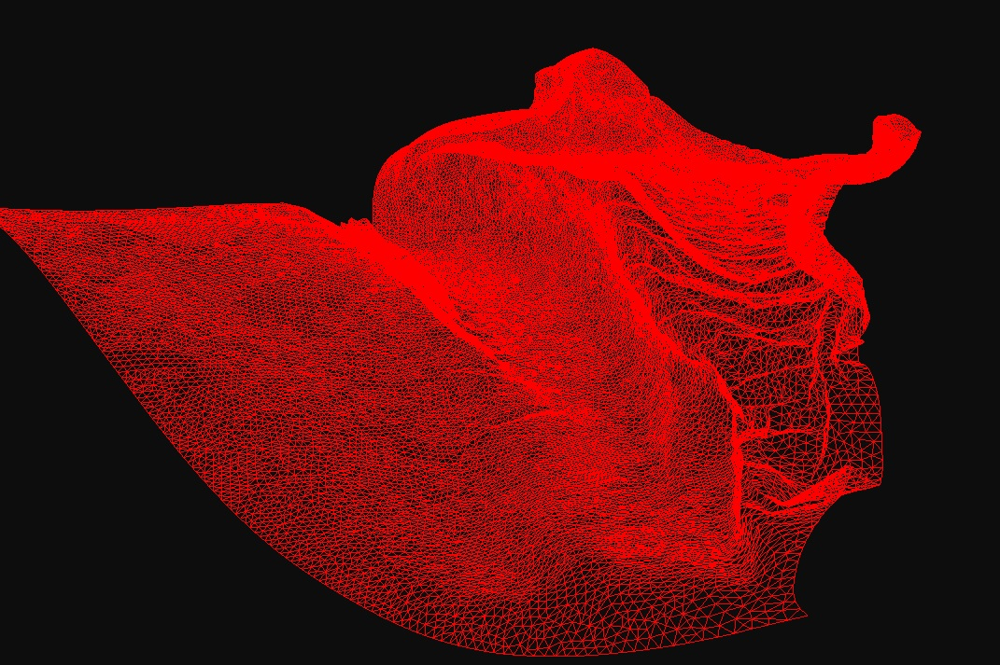

课程作业要求实现对布料进行自碰撞检测。
本文将介绍两种碰撞检测方法。
- 第一种方法检测每个三角形和所有其它三角形之间的碰撞，CPU碰撞检测时间约为1小时，CUDA加速后的碰撞检测时间约为6分钟。
- 第二种方法使用线性包围体层次结构(Linear Bounding Volume Hierarchy)建立二叉树，碰撞检测时间约为0.4秒。

## （二）碰撞检测算法

1. CPU原始算法

算法概述

对于场景中每一个三角形，遍历所有其它三角形，检测两个三角形之间的碰撞。为了避免一对三角形之间进行两次碰撞检测，设置只有当前三角形的索引小于遍历三角形的索引时才进行碰撞检测。另外，如果两个三角形有共同顶点，不计入碰撞。

关键代码

```cpp
#pragma omp parallel for
for (int i = 0; i < numTriangles; i++)
{
    // 由三角形索引得到三个顶点索引
    unsigned int i0 = indices[i * 3 + 0];
    unsigned int i1 = indices[i * 3 + 1];
    unsigned int i2 = indices[i * 3 + 2];

    // 由三个顶点索引得到三个顶点坐标
    vec3f p0(vertices[i0 * 3 + 0], vertices[i0 * 3 + 1], vertices[i0 * 3 + 2]);
    vec3f p1(vertices[i1 * 3 + 0], vertices[i1 * 3 + 1], vertices[i1 * 3 + 2]);
    vec3f p2(vertices[i2 * 3 + 0], vertices[i2 * 3 + 1], vertices[i2 * 3 + 2]);

    for (int j = 0; j < numTriangles; j++)
    {
        // 仅遍历上三角矩阵或下三角矩阵
        if (i >= j)
            continue;
        
        // 如果两个三角形有共同顶点，不计入碰撞
        if (i0 == j0 || i0 == j1 || i0 == j2)
            continue;
        if (i1 == j0 || i1 == j1 || i1 == j2)
            continue;
        if (i2 == j0 || i2 == j1 || i2 == j2)
            continue;
        
        ...

        // 检测两个三角形之间的碰撞
        if (collide(p0, p1, p2, q0, q1, q2))
        {
            s.insert(i);
            s.insert(j);
        }
    }
}
```

2. GPU原始算法

算法概述

由于每对三角形之间的碰撞检测任务是相互独立的，所以可以借助CUDA进行并行计算。理想情况下，我们为每对三角形之间的碰撞检测任务启动一个线程，所有的碰撞检测任务同时进行。但是场景中的三角形图元数量N往往非常大，我们往往不能够同时启动N<sup>2</sup>个线程，每个线程依旧需要执行多次碰撞检测的任务。下一小节的包围体层次结构能够大幅减少不必要的计算。

关键代码

```cpp
unsigned int i_offset = blockDim.x * gridDim.x;
unsigned int j_offset = blockDim.y * gridDim.y;

unsigned int i = threadIdx.x + blockIdx.x * blockDim.x;
while (i < num_triangles)
{
    unsigned int j = threadIdx.y + blockIdx.y * blockDim.y;
    while (j < num_triangles)
    {
        // 仅遍历上三角矩阵或下三角矩阵
        if (i >= j)
        {
            j += j_offset;
            continue;
        }

        ...

        // 如果两个三角形有共同顶点，不计入碰撞
        if (i0 == j0 || i0 == j1 || i0 == j2 ||
            i1 == j0 || i1 == j1 || i1 == j2 ||
            i2 == j0 || i2 == j1 || i2 == j2)
        {
            j += j_offset;
            continue;
        }

        ...

        // 检测两个三角形之间的碰撞
        if (collide(p0, p1, p2, q0, q1, q2))
        {
            atomicAdd(&flags[i], 1);
            atomicAdd(&flags[j], 1);
        }

        j += j_offset;
    }

    i += i_offset;
}
```

3. LBVH算法

算法概述

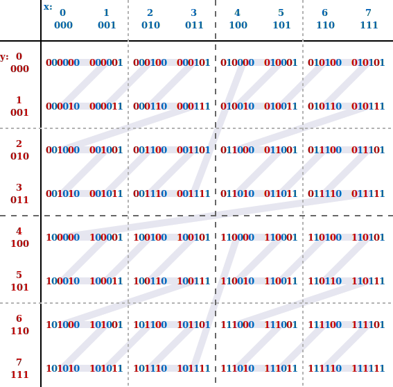

LBVH算法使用莫顿码（Morton codes）将包围体层次结构的构建问题简化为排序问题。莫顿码能够将数据从多维映射到一维，同时保持数据的局部特性。给定一个整数坐标，首先将该坐标每一维的整数表示为二进制数，然后将所有二进制数的每一位交错排列，得到一个新的二进制数，这个数就是该整数坐标的莫顿码。上图展示了当0≤x≤7且0≤y≤7时的莫顿码。将莫顿码按照数值大小进行排序并连线，就能得到Z形曲线（Z-order curve）。

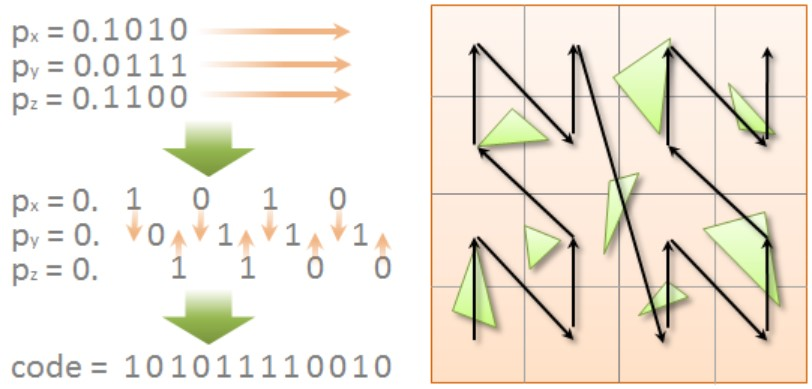

为了计算给定三维空间点的莫顿码，我们需要考察其坐标的二进制定点表示形式，如上图中的左图所示。首先，我们取每个坐标的小数部分，并在每一位后插入两个空隙来展开它。然后，我们将所有三个坐标的位交错在一起形成一个单一的二进制数，这个二进制数就是莫顿码。按照数值大小遍历莫顿码相当于沿着Z形曲线游走，如上图中的右图所示。

使用莫顿码对三角形进行排序的流程如下：

   1. 为每个三角形生成AABB包围盒
   2. 计算整个场景的包围盒
   3. 根据整个场景的包围盒，计算每个三角形包围盒中心点的归一化坐标
   4. 计算归一化坐标的莫顿码
   5. 使用基数排序算法对三角形进行排序

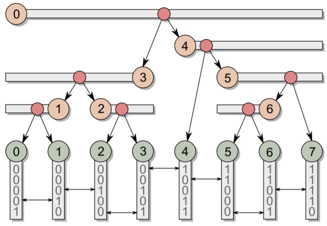

上图中的二叉树有如下性质：

   1. 假设场景中有N个三角形，那么二叉树中有N个叶节点和N-1个内部节点。
   2. 内部节点的划分依据为叶节点莫顿码的最高不同位。以上图为例，图中根节点包含8个叶节点，最高不同位为第一位，我们将第一位为0的叶节点划分到根节点的左子树，将第一位为1的叶节点划分到根节点的右子树；此时根节点的左子树包含4个叶节点，最高不同位为第三位，我们将第三位为0的叶节点划分到当前子树根节点的左子树，将第三位为1的叶节点划分到当前子树根节点的右子树；以此类推。
   3. 每个内部节点有一个编号，取值范围为[0,N-2]。内部节点的编号由其父节点的划分位置决定：如果父节点在叶节点i和i+1之间进行划分，那么左节点编号为i，右节点编号为i+1。对于每个内部节点i，叶节点i正好位于该内部节点包含的叶节点的区间边界。通过比较叶节点i与叶节点i-1和i+1莫顿码的最高不同位，我们可以判断叶节点i是位于区间的左边界还是右边界。如果叶节点i与i-1的最高不同位高于叶节点i与i+1的最高不同位，那么叶节点i是内部节点i对应区间的左边界，反之为右边界。
   4. 每个内部节点对应一个叶节点区间。因为区间内叶节点莫顿码的最高不同位一定低于区间外叶节点，所以可以以叶节点与区间外相邻叶节点莫顿码的最高不同位为基准，令区间从边界开始延伸，直到叶节点莫顿码的最高不同位大于等于该基准为止。这样就可以得到内部节点所对应的区间。

关键代码

   1. 莫顿码计算方法

   * 将归一化坐标的x,y,z转换为三个10位整数
   * 将三个10位整数交错排列成30位的莫顿码

```cpp
// Expands a 10-bit integer into 30 bits by inserting 2 zeros after each bit.
__device__
inline unsigned int expandBits(unsigned int v)
{
    v = (v * 0x00010001u) & 0xFF0000FFu;
    v = (v * 0x00000101u) & 0x0F00F00Fu;
    v = (v * 0x00000011u) & 0xC30C30C3u;
    v = (v * 0x00000005u) & 0x49249249u;
    return v;
}


// Calculates a 30-bit Morton code for the given 3D point located within the unit cube [0,1].
__device__
inline unsigned int mortonCode(float x, float y, float z)
{
    x = fmin(fmax(x * 1024.0f, 0.0f), 1023.0f);
    y = fmin(fmax(y * 1024.0f, 0.0f), 1023.0f);
    z = fmin(fmax(z * 1024.0f, 0.0f), 1023.0f);
    unsigned int xx = expandBits((unsigned int)x);
    unsigned int yy = expandBits((unsigned int)y);
    unsigned int zz = expandBits((unsigned int)z);
    return xx * 4 + yy * 2 + zz;
}

```

   2. 构建二叉树

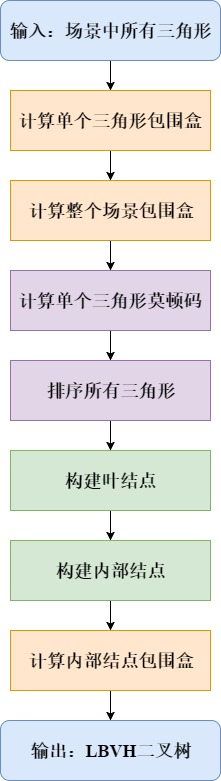

   * 计算单个三角形包围盒

使用thrust::transform函数根据三角形的三个顶点坐标计算轴对齐包围盒。

```cpp
thrust::transform(
    ...
    [vertices] __device__ (const triangle& tri)
    {
        aabb bbox;
        getAABB(tri, vertices, bbox);
        return bbox;
    }
);
```

   * 计算整个场景包围盒

使用thrust::reduce函数根据所有三角形包围盒计算整个场景包围盒。

```cpp
aabb topBBox = thrust::reduce(
    ...
    [] __device__ (const aabb& lhs, const aabb& rhs)
    {
        return merge(lhs, rhs);
    }
);
```

   * 计算叶节点莫顿码

首先根据整个场景包围盒计算每个三角形包围盒中心点的归一化坐标，然后根据归一化坐标计算莫顿码。

```cpp
thrust::transform(
    ...
    [topBBox] __device__ (const aabb& box)
    {
        // 归一化坐标
        float3 point = centroid(box);
        point.x -= topBBox.lower.x;
        point.y -= topBBox.lower.y;
        point.z -= topBBox.lower.z;
        point.x /= (topBBox.upper.x - topBBox.lower.x);
        point.y /= (topBBox.upper.y - topBBox.lower.y);
        point.z /= (topBBox.upper.z - topBBox.lower.z);

        // 计算莫顿码
        return mortonCode(point);
    }
);
```

   * 根据莫顿码排序三角形

假设有N个三角形，首先为每个三角形编号（0到N-1），然后使用thrust::stable_sort_by_key函数根据莫顿码排序三角形包围盒及其编号。

```cpp
auto tuple = thrust::make_tuple(d_aabbs.begin() + numInternalNodes, d_counts.begin());
thrust::stable_sort_by_key(d_codes.begin(), d_codes.end(), thrust::make_zip_iterator(tuple));
```

   * 构建叶节点

每个节点对象包括父节点索引、左子节点索引、右子节点索引和图元对象索引。对于叶节点来说，父节点索引将在之后构建内部节点时进行计算，左子节点索引和右子节点索引为空（这里设置为unsigned int数据类型的最大值），图元对象索引设置为上述步骤中已经排好序的三角形编号。

```cpp
thrust::transform(
    ...
    [] __device__ (unsigned int index)
    {
        node n;
        n.parentIdx = UINT_MAX;
        n.lchildIdx = UINT_MAX;
        n.rchildIdx = UINT_MAX;
        n.objectIdx = index;
        return n;
    }
);
```

   * 构建内部节点

对于内部节点来说，首先将其父节点索引设置为空（这里设置为unsigned int数据类型的最大值），然后计算该内部节点对应的叶节点区间，并根据区间范围内叶节点的莫顿码计算划分位置split。该内部节点的左子节点索引设置为split，右子节点索引设置为split+1。如果子节点是叶节点，需要将索引偏移内部节点个数。最后，设置子节点的父节点索引为当前节点索引。

```cpp
thrust::for_each(
    ...
    [nodes, codes, numTriangles] __device__ (unsigned int index)
    {
        // 父节点设置为空
        nodes[index].objectIdx = UINT_MAX;

        // 计算内部节点对应的叶节点区间
        uint2 range = determineRange(codes, numTriangles, index);

        // 计算叶节点区间的划分位置
        int split = findSplit(codes, range.x, range.y);

        // 划分内部节点
        nodes[index].lchildIdx = split;
        nodes[index].rchildIdx = split + 1;
        if (thrust::min(range.x, range.y) == split)
            nodes[index].lchildIdx += numTriangles - 1;
        if (thrust::max(range.x, range.y) == split + 1)
            nodes[index].rchildIdx += numTriangles - 1;
        
        // 更新子节点的父节点索引为当前节点索引
        nodes[nodes[index].lchildIdx].parentIdx = index;
        nodes[nodes[index].rchildIdx].parentIdx = index;
    }
);
```

   * 计算内部节点包围盒

我们为每个叶节点分配一个线程，这些线程能够并行计算内部节点的包围盒。并行计算内部节点的包围盒时，需要注意内部节点需要等待两个子节点的包围盒全部计算完成，才能开始计算自己的包围盒。这可以通过为每个内部节点设置一个flag来实现。我们将flag初始化为0。第一个线程到达时，该线程将flag设置为1后返回。第二个线程到达时，查询到flag为1，可以开始计算该内部节点的包围盒。

```cpp
thrust::for_each(
    ...
    [nodes, aabbs, nodeFlags] __device__(unsigned int index)
    {
        unsigned int parentIdx = nodes[index].parentIdx;
        while (parentIdx != UINT_MAX)
        {
            int oldFlag = atomicCAS(nodeFlags + parentIdx, 0, 1);
            // 第一个到达的线程直接返回
            if (oldFlag == 0)
                return;
            // 第二个到达的线程负责计算该内部节点包围盒
            assert(oldFlag == 1);

            unsigned int lchildIdx = nodes[parentIdx].lchildIdx;
            unsigned int rchildIdx = nodes[parentIdx].rchildIdx;
            aabb lbbox = aabbs[lchildIdx];
            aabb rbbox = aabbs[rchildIdx];
            aabbs[parentIdx] = merge(lbbox, rbbox);

            parentIdx = nodes[parentIdx].parentIdx;
        }
    }
);
}
```

   3. 遍历二叉树

我们为每个三角形分配一个线程，该线程负责遍历二叉树，寻找与当前三角形发生碰撞的其它三角形。每个线程使用栈来遍历二叉树。如果当前包围盒与遍历到的包围盒发生碰撞，并且发生碰撞的节点是内部节点，将该内部节点入栈；如果发生碰撞的是叶节点，进行两个三角形之间的碰撞检测。

```cpp
while (stack is not empty) {
	pop a parent node and find its children nodes;
	if (intersect(box, left child box)) {
		if (left child is a leaf node)
			check collision between triangles;
		else
			push left child node;
	}
	if (intersect(box, right child box)) {
		...
	}
}

```

### 运行结果

1. 运行环境

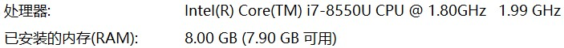

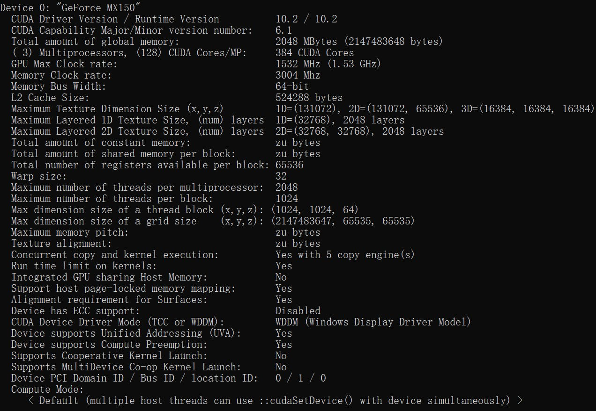

2. 运行结果统计

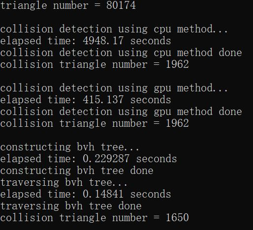

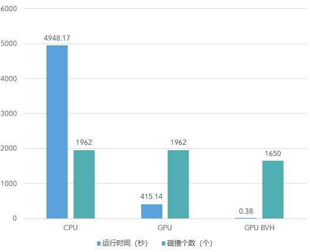

3. 运行结果展示

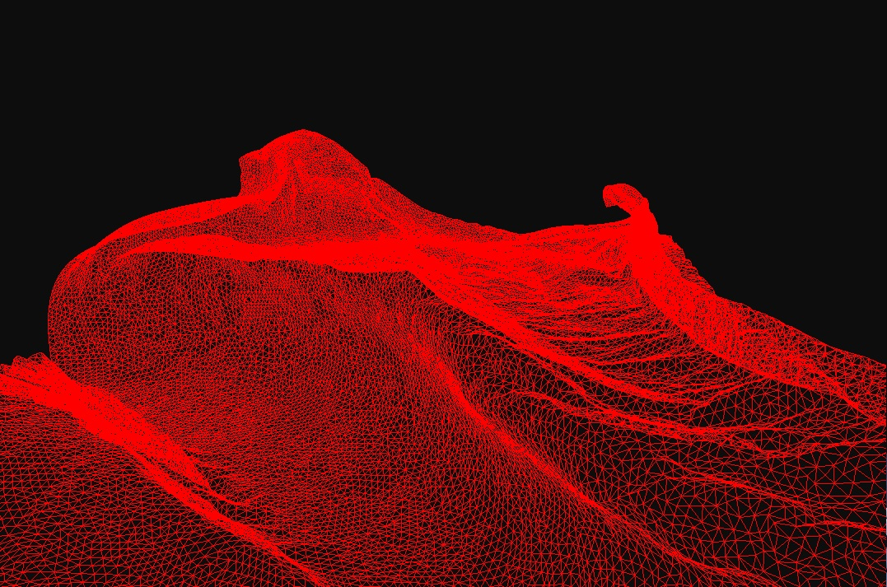

(a)布料网格

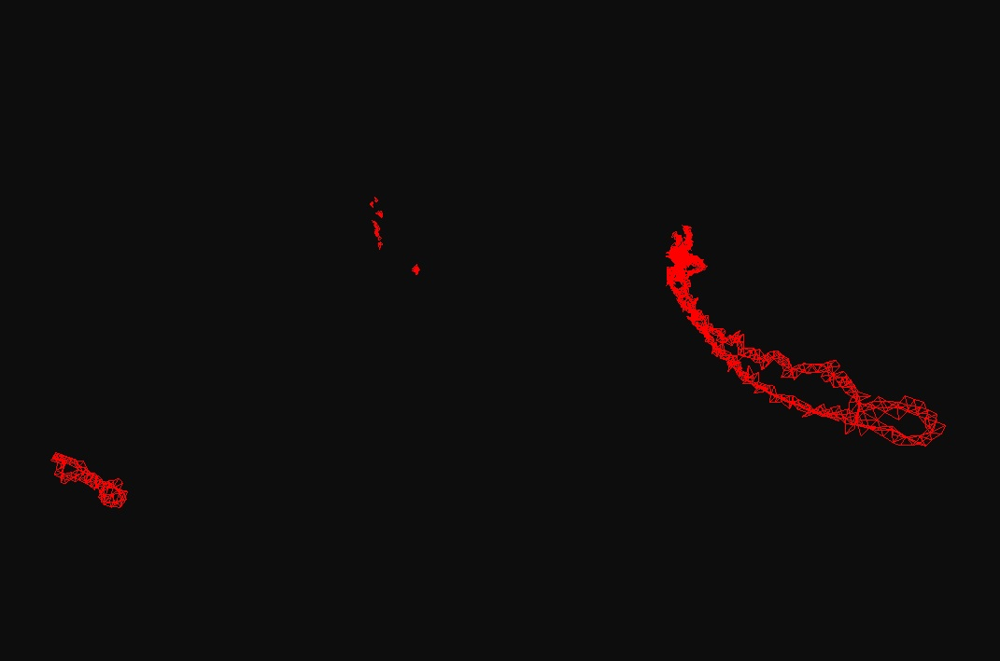

(b)CPU原始方法碰撞检测结果

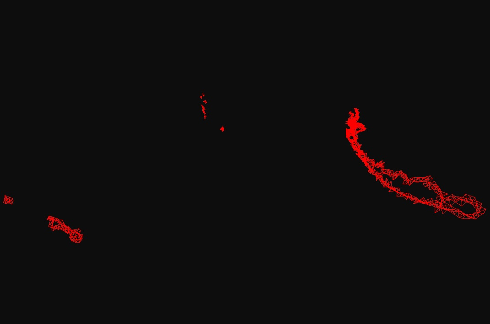

(c)GPU原始方法碰撞检测结果

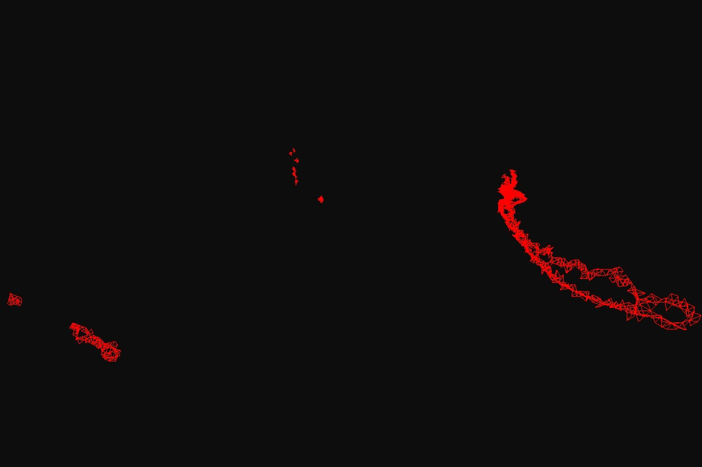

(d)GPU LBVH方法碰撞检测结果

4. 运行结果分析

从运行结果中可以发现一个问题，LBVH方法比原始CPU方法以及原始GPU方法检测到的碰撞三角形数量少。原始CPU方法和原始GPU方法都是直接进行三角形间的碰撞检测，而LBVH方法首先进行包围盒间的碰撞检测，然后进行三角形间的碰撞检测。基于上述原因，问题应该出在包围盒间的碰撞检测。由于场景中的三角形数量非常多，我们假设有N个三角形，那么二叉树的高度为log<sub>2</sub>N，采用32位浮点数据类型，那么在自底向上构建内部节点包围盒的过程中会逐步累积误差，导致在碰撞检测过程中丢失三角形。